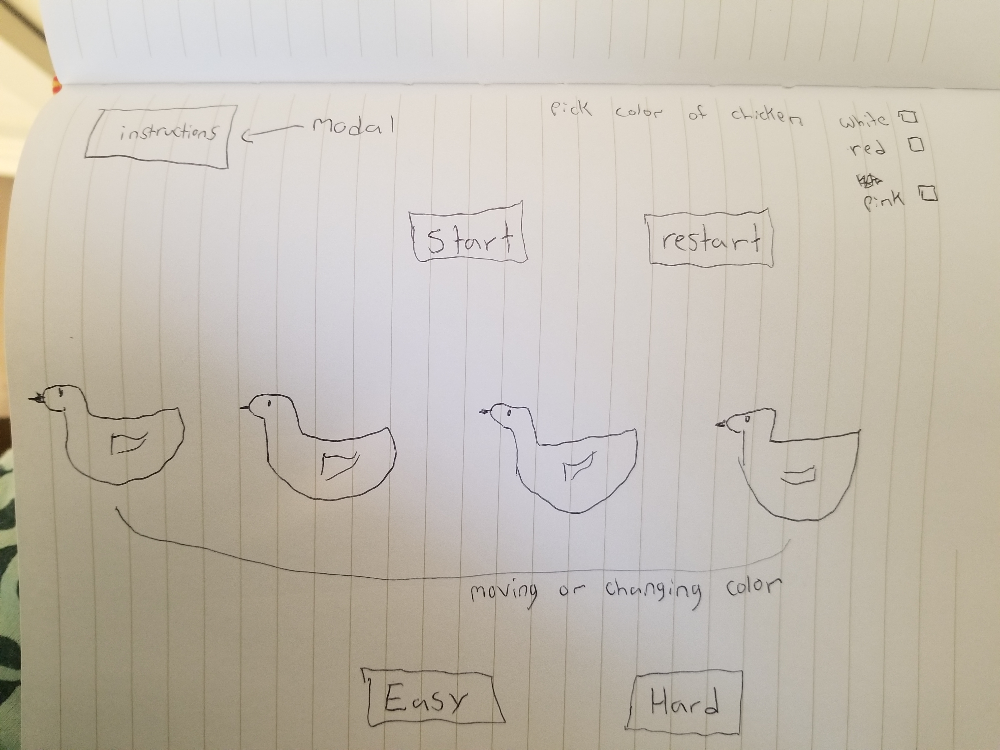
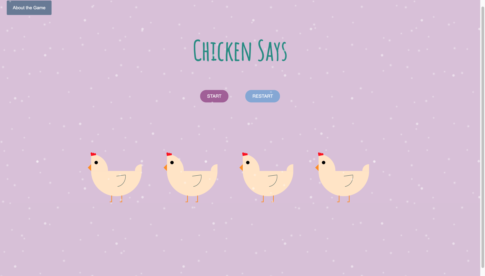

# Chicken Says

## Project Description
#### A browser-based memory game coded in Javascript, HTML, and CSS.

## Wireframe

## User Stories 
### MVP Goals
1. As a user, I want to play a web based browser game.
2. As a user, I want game instructions so I know how to play.
3. As a user, I want a way to start the game.
4. As a user, I want to be able to start the game over.
5. As a user, I want to see a clear pattern with lighting up or moving images.
6. As a user, I want the game to keep score and move to the next pattern when I am correct.

### Stretch Goals
1. As a user, I want to play on easy or hard mode.
2. As a user, I want the game to look attractive.
3. As a user, I want to be able to change the color of my chicken.
4. As a user, I want to be timed while I try to remember the pattern.
5. As a user, I want sound on my game.

## Screenshot of game

## Unsolved problems and hurdles

I had a lot of trouble with the CSS chickens mostly because I wasn't careful enough and accidently made a copy of two heads on each chicken. This caused all kinds of problems with my code and changing colors. I also spent way to long trying to change and animate my chickens which made me run out of time. I'm a little dissapointed I didn't make many of my stretch goals and I need to learn how to plan my time better.

